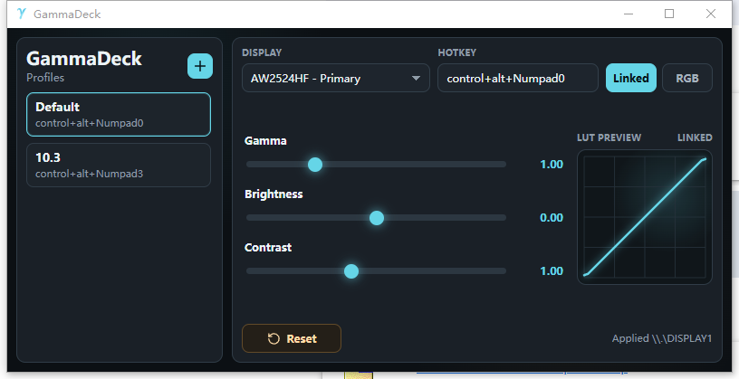

# GammaDeck

GammaDeck is a lightweight Windows app for switching display gamma profiles with global hotkeys.

It is designed for people who use multiple monitors, switch between different lighting conditions, or want fast per-display gamma adjustments without opening Windows display settings.



## Features

- Multi-display support: choose which monitor a profile applies to.
- Multiple profiles: create different presets for work, games, night use, or specific monitors.
- Global hotkeys: switch profiles instantly from anywhere.
- Linked RGB mode: adjust gamma, brightness, and contrast together.
- Per-channel RGB mode: fine-tune red, green, and blue independently.
- LUT preview: see the generated curve before applying it.
- Baseline-aware adjustments: GammaDeck captures the current display ramp and applies profiles relative to that baseline instead of blindly replacing the user's existing color state.
- Baseline controls: update the current baseline, reset it to the first-run baseline, or reset it to a neutral baseline.
- Reset control: return the current profile's sliders to neutral values.
- Tray support: keep GammaDeck available in the background.
- Portable config: release builds keep `GammaDeck.config.json` beside `GammaDeck.exe`.

## Download And Run

GammaDeck is distributed as a portable Windows zip.

1. Download `GammaDeck-windows-x64-portable.zip` from a GitHub release.
2. Unzip it anywhere.
3. Run `GammaDeck.exe`.

There is no installer. Profiles and hotkeys are saved in the same portable folder as the app.

## WebView2 Requirement

GammaDeck uses Tauri, so it needs Microsoft Edge WebView2 Runtime on Windows. Most Windows 10/11 systems already include it.

If the app does not open, or Windows shows a WebView2-related startup error, install WebView2 Runtime from Microsoft:

<https://developer.microsoft.com/en-us/microsoft-edge/webview2/>

Use the Evergreen Bootstrapper for normal installs, or the Evergreen Standalone Installer for offline machines.

## How To Use

1. Select or create a profile from the left sidebar.
2. Choose the target display.
3. Set a global hotkey, such as `control+alt+Numpad0`.
4. Adjust gamma, brightness, and contrast.
5. Use `Linked` mode for simple tuning, or `RGB` mode for per-channel correction.
6. GammaDeck applies the profile when you select it or press its hotkey.

## Baselines And Color Calibration

GammaDeck uses the GPU gamma ramp. Windows display calibration, ICC/WCS profile loaders, and GPU control panels can also affect this ramp. To avoid wiping out the user's existing color setup, GammaDeck treats a saved baseline ramp as the reference point for each display.

On first run, or when upgrading from an older config that has no saved baseline, GammaDeck reads the current ramp for each supported display and stores it as both:

- The **first-run baseline**: the earliest reference GammaDeck has saved for that display.
- The **current baseline**: the reference used when applying profiles.

With this model, `Gamma 1.00`, `Brightness 0.00`, and `Contrast 1.00` mean "leave the saved baseline unchanged." Profile adjustments are applied on top of the current baseline, so existing Windows calibration or GPU control panel color changes are preserved as long as they were present when the baseline was captured.

The **Baseline** button saves the display's current ramp as the new current baseline. If a GammaDeck profile is visible when you do this, that visible result becomes part of the baseline. GammaDeck resets the current profile to neutral afterward so the same adjustment does not stack again.

The small menu next to **Baseline** provides two reset options:

- **Reset to first-run baseline** restores the current baseline to the first ramp GammaDeck saved for that display. This is useful if the baseline has been updated and you want to go back to GammaDeck's original reference.
- **Reset to neutral baseline** replaces the current baseline with a plain `0 -> 65535` ramp. This makes neutral values mean no extra baseline correction from GammaDeck, but it may ignore Windows calibration or GPU control panel adjustments.

Changing the baseline changes the reference point for every profile targeting that display. Other profiles keep their saved slider values, but they may need to be manually readjusted after a baseline update or reset.

## Current Limitations

- Real gamma changes are currently implemented only on Windows.
- macOS and Linux can run the app shell, but gamma apply/reset actions are unsupported.
- GammaDeck adjusts the GPU gamma ramp only. It does not change physical monitor brightness, DDC/CI settings, HDR behavior, or ICC/WCS color profile files.
- Other apps, GPU drivers, Windows display events, HDR mode changes, and color calibration tools may overwrite the active gamma ramp after GammaDeck applies a profile.
- Profiles target one display at a time.

## Development

Install dependencies:

```bash
pnpm install
```

Run the app locally:

```bash
pnpm tauri dev
```

Run checks:

```bash
pnpm exec tsc --noEmit
pnpm run build
cargo check --manifest-path src-tauri/Cargo.toml
cargo clippy --manifest-path src-tauri/Cargo.toml --all-targets -- -D warnings
```

Build a portable Windows executable:

```bash
pnpm tauri build --no-bundle
```

The executable is written to `src-tauri/target/release/gammadeck.exe` on Windows.
